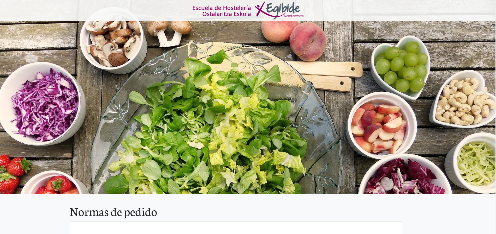

<h1 align="center">Codename Jotun</h1>
<h3 align="center">Web de pedidos para la Escuela de Hostelería de Egibide.</h3>

## IMPORTANTE
Si se quiere probar o desarrollar esta web, el envio de correo necesita ser configurado y usado en un servidor. NO funciona en un XAMPP local.

## ¿Qué es?
Un web minimalista y user friendly para realizar pedidos online a la Escuela de Hosteleria de Egibide.

## Cómo desplegar la aplicación para su desarrollo
Necesitaremos XAMPP para su despliegue.
 

**Lo primero:** Iniciamos el modulo de mysql de XAMPP y nos dirigimos a "PHP My Admin" y ejecutamos los scripts SQL que se encuentran en "Base de datos".
 
**Lo segundo:** Configuramos la carpeta htdocs en XAMPP para redireccionar a donde se encuentra el proyecto. Iniciamos el módulo de apache y nos metemos en /localhost.

## Capturas de pantalla  

<h6 align="center">Pantalla de inicio</h6>

## Documentación
**Documentación del proyecto [link](Documentacion/Documentación.pdf)** 

   

 

###### Realizado por MAD project bajo licencia [MIT](LICENSE). 2019.
